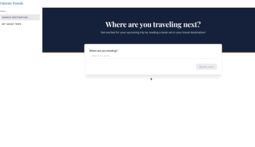
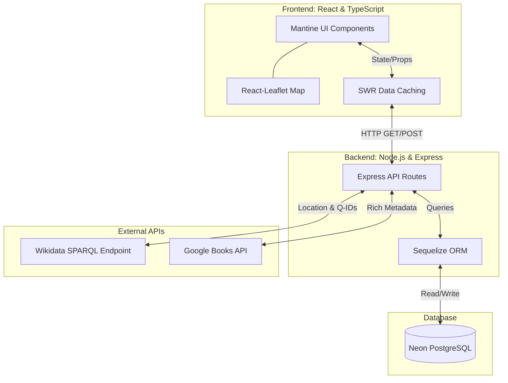

# Literary Travels
Embark on a literary journey by searching for books inspired by your travel destinations. 

## Features
By combining geographical data with literary databases, Literary Travels offers a unique way to curate your vacation reading lists:

* **Geospatial Book Search:** Powered by Wikidata SPARQL queries, search for any city globally and instantly discover books set in that exact location
* **Interactive Map Visualization:** Explore your literary hits on an interactive Leaflet map, complete with dynamic pins and coordinates
* **Rich Metadata & Lazy Loading:** Integration with the Google Books API provides covers, summaries, and aggregated ratings. Metadata is lazily loaded to protect user bandwidth and prevent API rate-limiting
* **Trip Organization (In Progress):** Save books to a global master library and curate them into specific, folder-based itineraries (e.g., "London 2026", "Summer Beach Reads")

## Architecture & Tech Stack

* **Frontend:** React, TypeScript, Mantine UI, SWR (Data Fetching & Caching), React-Leaflet
* **Backend:** Node.js, Express
* **Database:** PostgreSQL (Hosted via Neon), Sequelize ORM
* **External APIs:** Wikidata (Geospatial/Book data), Google Books API (Enriched Metadata)
* **Testing:** Vitest, React Testing Library

## Roadmap

**Phase 1 & 2: Core Search & Map Visualization (Completed)**
* Full-stack foundation with Node.js/Express and React
* Complex SPARQL integration for global book discovery
* Interactive Leaflet map and responsive Mantine UI grid
* Postgres database initialization for "Saved Books" persistence

**Phase 3: Trip Organization (Current)**
* Implementing a Many-to-Many relational database architecture to allow users to group saved books into custom folders and itineraries

**Phase 4: Authentication & Deployment (Upcoming)**
* Implement robust user authentication and authorization
* Deploy a password-protected live demo environment
* Provision infrastructure via a cloud provider (Provider TBD)

**Phase 5: Data Retrieval Improvements**
* TBD, will need to figure out way to improve the latency issues with Wikidata

## Local Development
To run this project locally, you will need Node.js and a local Postgres instance (or a Neon connection string).

1. Clone the repository
2. Run `npm install` in both the frontend and backend directories
3. Duplicate `.env.example` to `.env` and add your database credentials and Google Books API key
4. Run `npm run dev` to start the development servers
